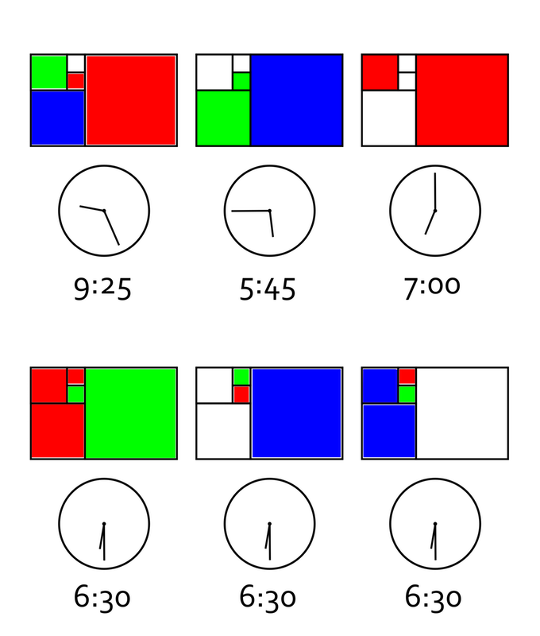
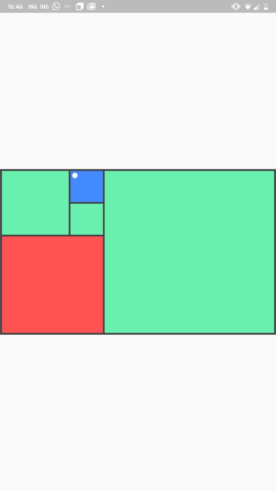
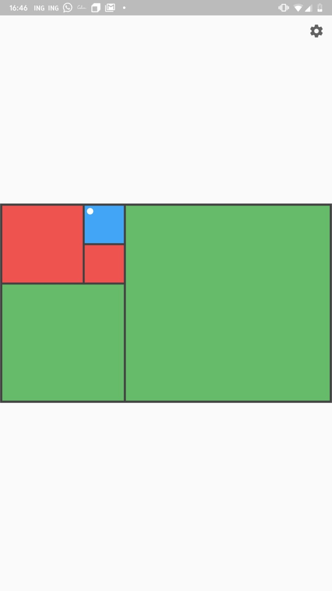
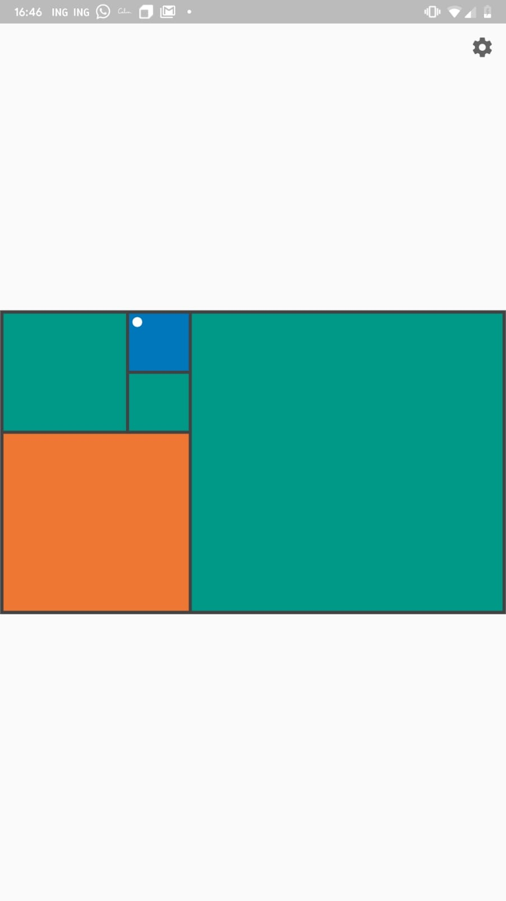
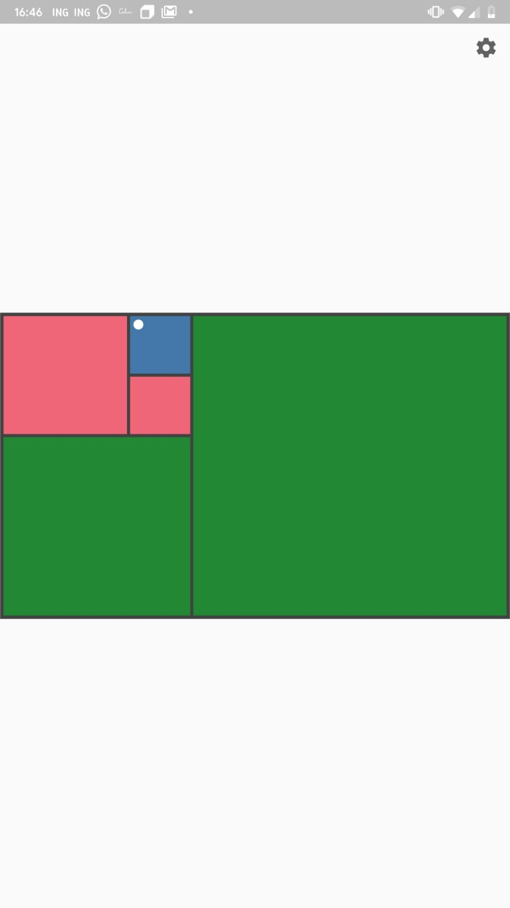

# Fibonacci Clock
A submission for the flutter clock challenge inspired by the [fibonacci clock on the internet](https://www.kickstarter.com/projects/basbrun/fibonacci-clock-an-open-source-clock-for-nerds-wit).
4 different colorschemes are available for the clock, if which two are colorblind friendly.

## How does the clock work
A fibonacci clock works by utilizing three colours, where one colour is used for the hours, one color for the minutes and one color for a combination of both. An example from the kickstarter [website](https://www.kickstarter.com/projects/basbrun/fibonacci-clock-an-open-source-clock-for-nerds-wit) is shown below: 

_To tell time on the Fibonacci clock you need to do some math. To read the hour, simply add up the corresponding values of the red and blue squares. To read the minutes, do the same with the green and blue squares. The minutes are displayed in 5 minute increments (0 to 12) so you have to multiply your result by 5 to get the actual number._

This implementation of the clock also has small dots in the corner of the blocks, which denote the minutes.
Below the 4 themes that are currently implemented are shown below. With the 3rd and 4th one being colorblind friendly.

  
   
  
  

